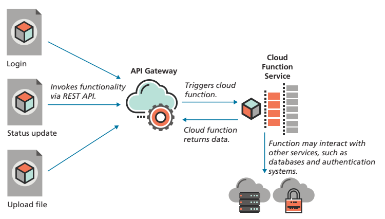

# เทคโนโลยีแบบไร้เซิร์ฟเวอร์

แม้ว่าการคำนวณเว็บแบบไร้เซิร์ฟเวอร์จะส่งต่อความรับผิดชอบของเซิร์ฟเวอร์ แต่ก็ยังมีการใช้เซิร์ฟเวอร์อยู่ที่ไหนสักแห่ง คำถามที่ตามมาคือ แอปพลิเคชันของคุณใช้เซิร์ฟเวอร์ที่ส่งต่อความรับผิดชอบเหล่านี้อย่างไร มีหลายวิธีในการตอบคำถามนี้

### ฐานข้อมูลแบบบริการ (Databases-as-a-Service)

ในบทถัดไป คุณจะใช้ทั้งฐานข้อมูล SQL และ NoSQL การกำหนดค่าระบบจัดการฐานข้อมูลอย่างเหมาะสมต้องใช้ทักษะเฉพาะ ดังนั้นขั้นตอนแรกในการคำนวณแบบไร้เซิร์ฟเวอร์คือ ฐานข้อมูลแบบบริการ (DBaaS) ตัวอย่างเช่น แทนที่จะติดตั้ง MySQL หรือ Oracle ทีมพัฒนาสามารถใช้บริการ Amazon Relational Database Service บน AWS, Google Cloud SQL, หรือ Oracle Database Cloud service แทนที่จะติดตั้ง MongoDB หรือฐานข้อมูล NoSQL อื่นๆ พวกเขาสามารถใช้ MongoDB Atlas, AWS DynamoDB, หรือ Google Firebase ได้

### แพลตฟอร์มแบบบริการ (Platform-as-a-Service)

วิธีการเข้าใกล้แบบไร้เซิร์ฟเวอร์ในยุคแรกๆ มักถูกเรียกว่า แพลตฟอร์มแบบบริการ (PaaS) โดยที่ทีมพัฒนาสามารถเช่าทรัพยากรที่ต้องการจากบริการคลาวด์ที่ให้ไม่เพียงแต่เซิร์ฟเวอร์เสมือนและพื้นที่จัดเก็บข้อมูลเท่านั้น แต่ยังรวมถึงระบบปฏิบัติการ, ระบบจัดการฐานข้อมูล, และสแต็กแอปพลิเคชันที่จำเป็น (เช่น Node.js) ในลักษณะที่ง่ายต่อการพัฒนา Heroku, AWS Elastic Beanstalk, Google App Engine, และ Netlify เป็นตัวอย่างที่นิยมของวิธีการนี้

บริการเหล่านี้อาจดึงดูดนักพัฒนานักเรียนเป็นพิเศษ ด้วย Heroku หรือ Netlify คุณสามารถติดตั้งเครื่องมือ CLI ที่รวมเข้ากับ Git และ GitHub การนำแอปพลิเคชันไปใช้งานบนบริการเหล่านี้มักเป็นเพียงการสร้าง Git remote แล้วใช้คำสั่ง `git push`.

### Functions-as-a-Service

แม้ว่าโมเดล Database-as-a-Service และ Platform-as-a-Service จะช่วยลดความจำเป็นในการติดตั้งและกำหนดค่าซอฟต์แวร์เซิร์ฟเวอร์ แต่คุณอาจยังคงต้องเขียนโค้ด PHP หรือ Node.js กับพวกมัน นั่นคือ ทั้ง DBaaS และ PaaS ไม่ใช่แบบไร้เซิร์ฟเวอร์อย่างแท้จริง เมื่อนักพัฒนาพูดถึงการคำนวณแบบไร้เซิร์ฟเวอร์ พวกเขามักจะหมายถึงสถาปัตยกรรมที่ไม่ต้องเขียนโค้ด PHP หรือ Node.js แบบปกติ แต่หมายถึงสถาปัตยกรรมที่รู้จักกันในชื่อ **Functions-as-a-Service (FaaS)** สถาปัตยกรรมนี้ใช้ความสามารถล่าสุดของแพลตฟอร์มคลาวด์ เช่น AWS Lambda, Azure Functions, หรือ Google Cloud Functions เพื่อนำฟังก์ชันแต่ละตัวไปใช้เป็นจุดสิ้นสุด API เต็มรูปแบบ นั่นคือ ฟังก์ชันการทำงานฝั่งแบ็กเอนด์ที่เว็บไซต์ของคุณต้องการ เช่น การรันคิวรี่ฐานข้อมูล, อัปโหลดภาพผู้ใช้ไปยังพื้นที่จัดเก็บคลาวด์, หรือประมวลผลการชำระเงิน สามารถทำงานเป็นฟังก์ชันที่เป็นอิสระซึ่งถูกเรียกใช้บนแพลตฟอร์มคลาวด์เมื่อมีเหตุการณ์บางอย่างเกิดขึ้น เหตุการณ์นี้อาจถูกเรียกใช้โดยคำขอ HTTP (เช่น คำขอ API) หรือทริกเกอร์เหตุการณ์ภายในสภาพแวดล้อมคลาวด์

หนึ่งในคุณสมบัติที่น่าสนใจของวิธีการใช้ฟังก์ชันบนคลาวด์คือรูปแบบการชำระเงินที่น่าดึงดูด แทนที่จะจ่ายตามชั่วโมงเหมือนโครงสร้างพื้นฐานคลาวด์ FaaS คุณจ่ายเฉพาะจำนวนคำขอการเรียกใช้และระยะเวลาการเรียกใช้เท่านั้น ณ เวลาที่เขียนบทความนี้ ภายในระดับฟรีของ AWS (ซึ่งใช้ได้หนึ่งปี) AWS Lambda (ซึ่งเป็นบริการที่ได้รับความนิยมมากที่สุด) มอบสิทธิ์ให้คุณได้รับคำขอหนึ่งล้านครั้งต่อเดือนพร้อมกับเวลาประมวลผล 400,000 GB-วินาทีต่อเดือนฟรี แม้จะอยู่นอกระดับฟรีที่มีข้อจำกัดเวลา การเรียกเก็บเงินก็ยังคงต่ำมาก: 0.20 ดอลลาร์สหรัฐฯ ต่อคำขอหนึ่งล้านครั้ง

#### วิธีการทำงานในทางปฏิบัติ:

* **การเขียนโค้ด**: บริการฟังก์ชันบนคลาวด์สนับสนุนภาษาหลายภาษา แต่ภาษาที่ใช้บ่อยที่สุดคือ JavaScript ที่ใช้กับ Node.js คุณเขียนฟังก์ชันบนคลาวด์โดยใช้โปรแกรมแก้ไขข้อความแล้วอัปโหลดไปยังบริการ จากนั้นใช้ API Gateway บนคลาวด์เพื่อเรียกใช้ฟังก์ชันเหล่านี้
* **การนำไปใช้งาน**: แอปพลิเคชันเว็บของคุณสามารถเป็นแบบไร้เซิร์ฟเวอร์ได้จริงๆ ตัวอย่างเช่น มีเพียง JavaScript, CSS, และ HTML บนเบราว์เซอร์เท่านั้น เมื่อแอปพลิเคชันต้องการฟังก์ชันเฉพาะของเซิร์ฟเวอร์ มันจะใช้ API Gateway บนคลาวด์เพื่อเรียกใช้ฟังก์ชันบนคลาวด์หนึ่งฟังก์ชัน

#### ข้อดีของโมเดลแบบไร้เซิร์ฟเวอร์เต็มรูปแบบ:

* **การปรับใช้งานที่ง่ายขึ้น**: ในแง่ของการปรับใช้งาน เว็บไซต์ของคุณประกอบด้วยทรัพยากรแบบ static เท่านั้น เช่น ไฟล์ JavaScript, CSS, และ HTML ซึ่งทำให้การปรับใช้งานง่ายขึ้นมาก โดยคุณเพียงแค่ต้องอัปโหลดทรัพยากรเหล่านี้ไปยัง CDN (Content Delivery Network) การเติบโตของความสนใจใน **JAM Stack (JavaScript, APIs, Markup)** เป็นการแสดงออกของโมเดลไร้เซิร์ฟเวอร์ใหม่นี้

เมื่อเวลาผ่านไป มีแนวโน้มว่าฝั่งเซิร์ฟเวอร์ของการพัฒนาเว็บจะเกี่ยวข้องกับการบริโภคสินค้าที่ "เช่า" จากบริการของบุคคลที่สามมากขึ้น.

<figure><figcaption>
รูปที่ 14 Functions-as-a-Service
</figcaption></figure>
